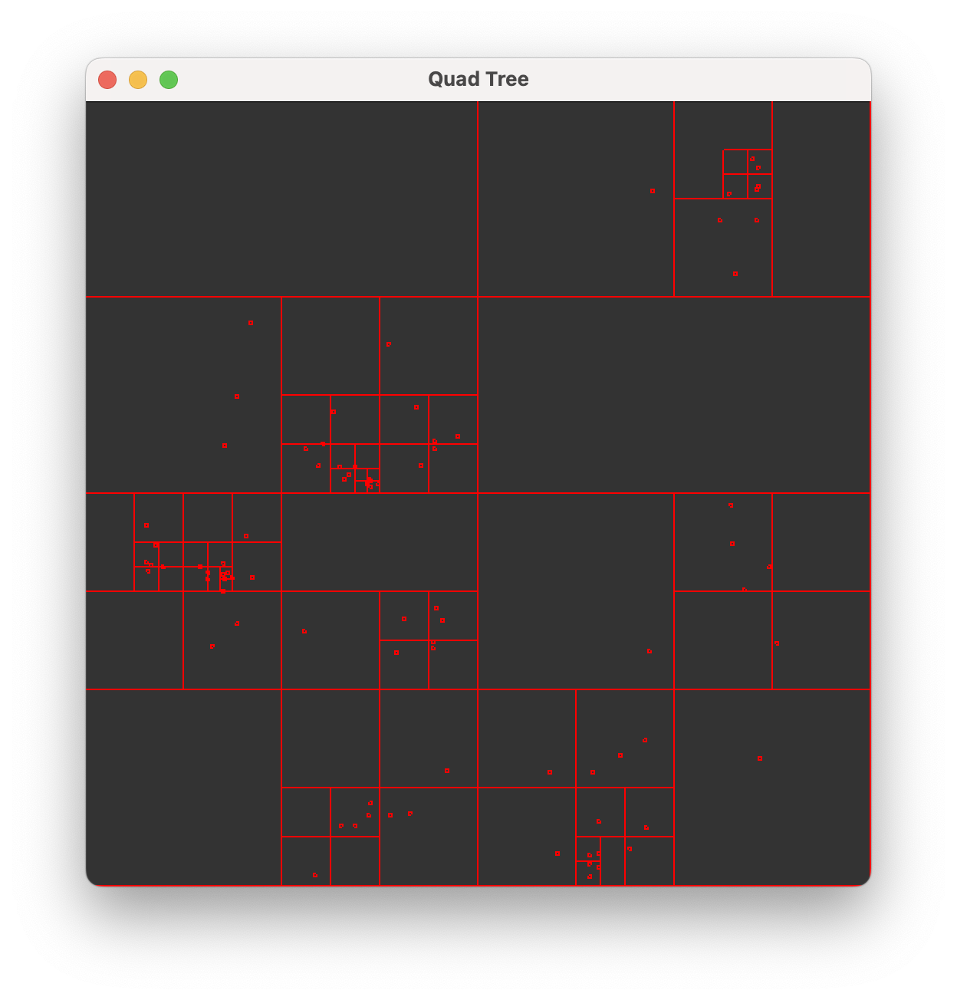
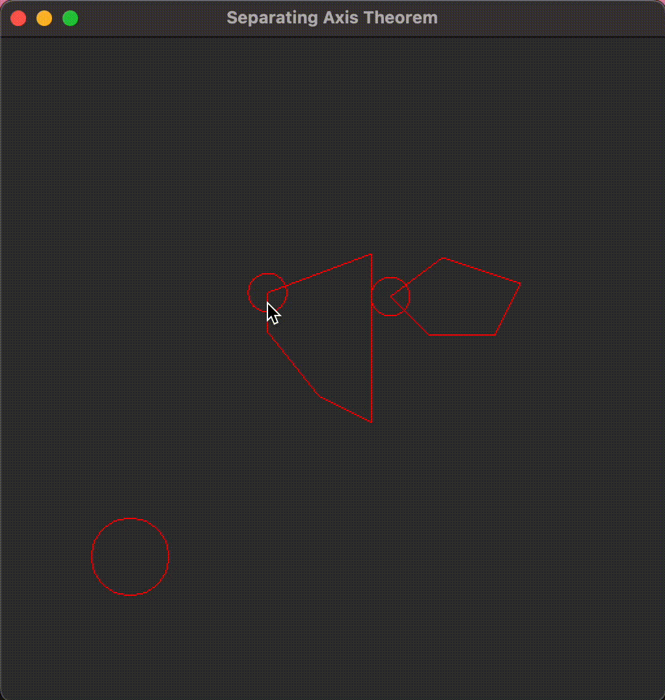
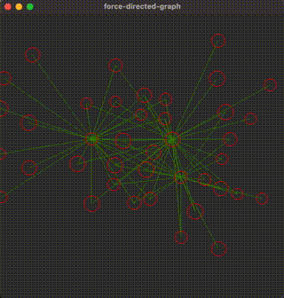

# Toy-algo
[](https://_hakatime.hsupc.com/badge/svg/c3e4d248-37a9-400a-a42c-bfc4f67111ad)

# Usage

```bash
$ ros run -l quadtree.lisp

or

$ sbcl -l quadtree.lisp
```

# Gallery
|Quadtree|SAT|Force-directed graph|
|--|--|--|
|</img> | </img>|</img>|

